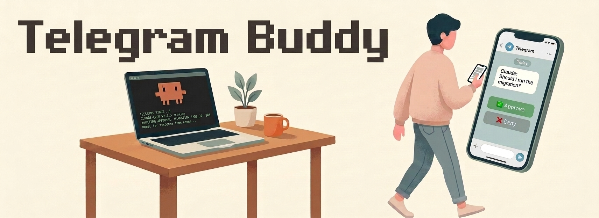
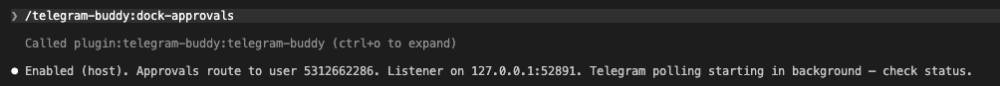
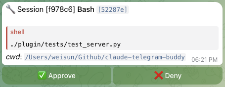
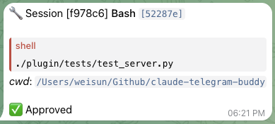
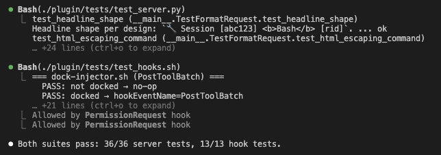
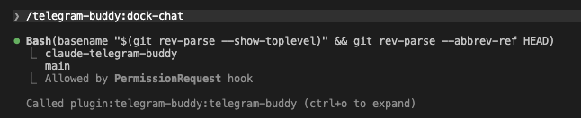
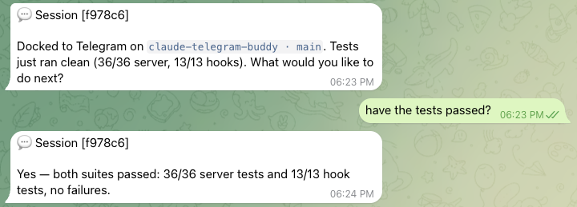

# Claude Telegram Buddy



A Claude Code plugin for **driving an active Claude session from your phone when you have to step away from the desk**.

> **Not a "Claude Code as Telegram chatbot" tool.** This plugin extends an *already-running* terminal session to your
> phone. The terminal is the persistent home; the phone is a temporary remote control.

## Usage — step away, come back

The whole workflow is three moments, three slash commands.

**1. Before you go** — pick the mode that fits how long you'll be away:

- `/telegram-buddy:dock-approvals` — for stepping away briefly (coffee, bathroom, a quick meeting). 
  
  Phone buzzes for each permission prompt; tap ✅ Approve or ❌ Deny.
  
- `/telegram-buddy:dock-chat` — for leaving the desk entirely (lunch, errands, the rest of the afternoon). 
  
  The whole conversation routes to Telegram; your replies become Claude's next prompt.

**2. While you're gone** — Claude keeps working. Your phone is the terminal: glance, tap, reply.

**3. When you're back** — `/telegram-buddy:undock` from the terminal, or just reply `undock` in Telegram. The terminal
is exactly where you left it. Scrollback intact, session never died.

## What it looks like

### dock-approvals — phone buzzes, you tap



Run `/telegram-buddy:dock-approvals` from the terminal. The bridge confirms approvals will route to your phone, then
you walk away.



Phone buzzes when Claude needs permission. The bubble shows the tool name, the command preview, and the cwd — enough
context to decide without opening the terminal.



Tap ✅ Approve and the bubble updates. The buttons disappear, the verdict stays as scrollback, and Claude continues in
the terminal you walked away from.



Meanwhile, that terminal kept working — tests passed, output streamed, the session never stalled.

### dock-chat — drive the whole conversation



Run `/telegram-buddy:dock-chat` from the terminal. Claude acknowledges the dock contract and routes every subsequent
assistant turn to your phone.



Now your phone is the conversation. Claude asks, you reply on Telegram, Claude treats your reply as the next prompt —
markdown renders properly via `telegramify-markdown`. When you're back at the desk, `/telegram-buddy:undock` (or just
reply `undock`) and pick up where you left off.

## Install

```text
/plugin marketplace add Jacksunwei/claude-telegram-buddy
/plugin install telegram-buddy@telegram-buddy
```

### First-time setup

Three quick steps:

1. **Bot token** — DM [@BotFather](https://t.me/BotFather), run `/newbot`, follow the prompts, copy the HTTP API token.
1. **Your user ID** — DM [@userinfobot](https://t.me/userinfobot) and copy the `Id` it returns.
1. **DM your new bot once** (any message) — Telegram requires you to initiate before a bot can message you back.

The `install` command prompts you for the token and user ID — paste them in.

### Re-configuring

To rotate the bot token, switch bots, or change your user ID: `/plugin` → telegram-buddy → **Configure options** →
update values → `/reload-plugins`.

## License

Apache-2.0 — see [LICENSE](./LICENSE).
